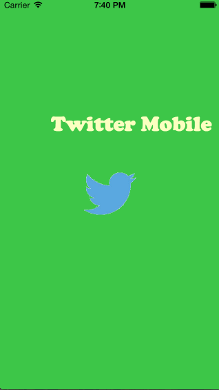

# TwitterRedux - Refactor of Twitter Mobile Client

This is the refactor of Twitter Mobile ios mobile app for Twitter using the [Twitter API](https://dev.twitter.com/overview/documentation). 

Time spent: 12 hours spent in total

Completed user stories:

Hamburger menu
* Swipe right to reveal the menu, swipe left to hide it.
* Menu includes links to Profile and home timeline. click the link will hide the menu and show Profile or timeline in container.

Profile Page
* Contains the user header view
* Contains a section with the users basic stats: # tweets, # following, # followers

Home Timeline
* Tapping on a user image should bring up that user's profile page

Walkthrough of all user stories:

GIF created with LiceCap (http://www.cockos.com/licecap/) .
 